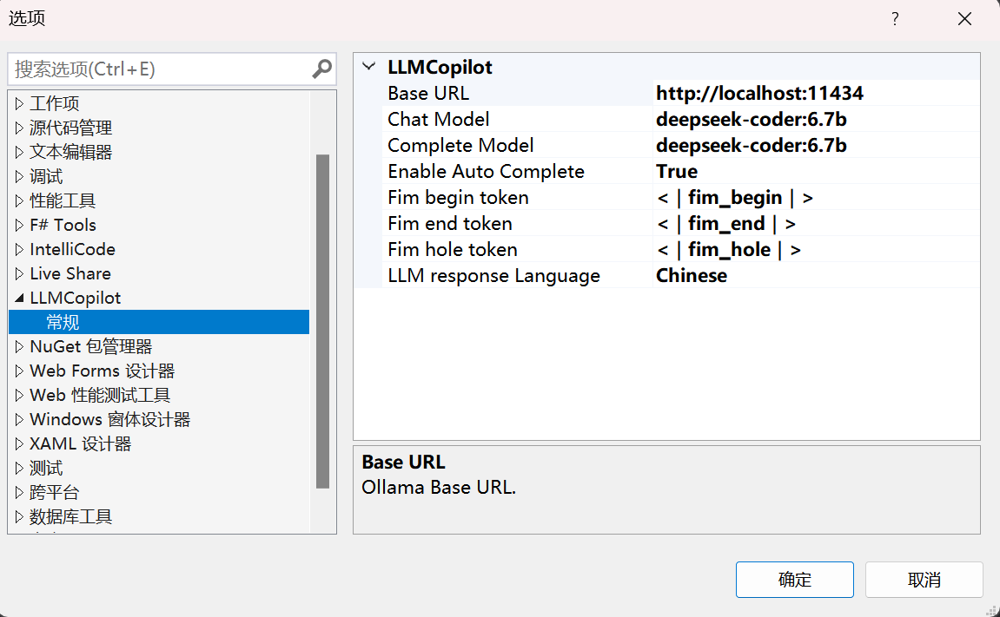
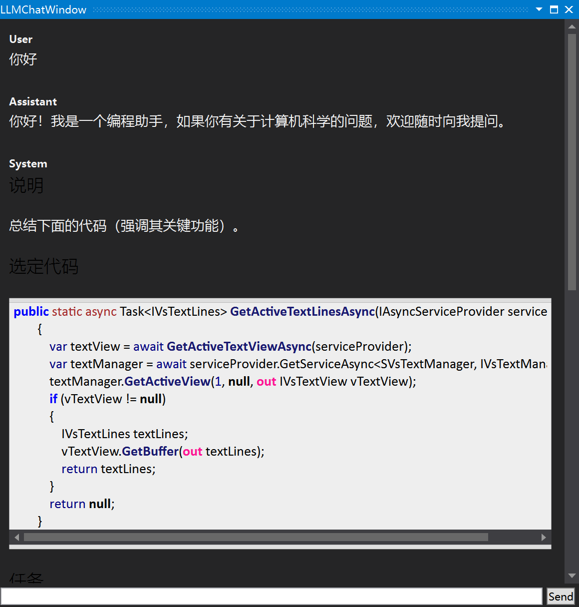
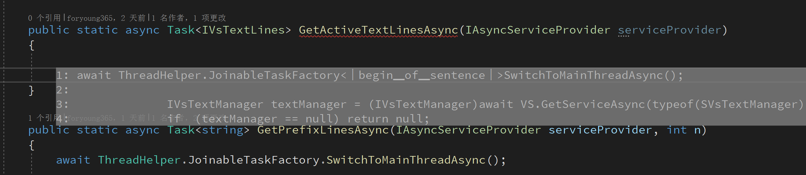

# LLMCopilot
[English](https://github.com/foryoung365/vs-extension-llmcopilot/blob/main/README_EN.md)

这是一个基于[Ollama](https://github.com/ollama/ollama)的Visual Studio扩展。得益于Ollama的本地化部署和强大的LLM（大型语言模型）支持，你可以像使用github copilot一样获得代码提示和建议，但是所有数据都在本地，甚至可以离线运行。

**如果此插件对你有帮助，请在marketplace中给我们一个五星评价。**

## 版本记录

[版本记录](./CHANGELOG.md)

- 请注意，接受所有预测的快捷键修改为了`Alt+Q`，这样可以减少正常输入过程中使用`Ctrl+C`等组合键被误判为接受预测。详情请查看`设置`部分。

## 功能
- 基于`Ollama`的本地大模型，所有数据都在本地，即使离线也可使用
- 基于大模型的能力辅助编程
  - 解释代码
  - 自动补全
  - 代码查错
  - 添加注释
  - 和本地大模型聊天
  - 生成单元测试
  
## 设置
- 支持自定义使用不同的大模型，您可以自行尝试
  - 自定义聊天大模型
  - 自定义自动补全大模型

- 支持自定义模型"Fill in the middle" token，可兼容更多大模型
- 代码自动补全开关，默认`关闭`
    - 按下`Alt+Q`键接受所有预测
    - 按下`数字1-9`，接受前N行预测
    - 按下`ESC`键拒绝预测
  
- 注意！默认使用`DeepSeek-Coder:6.7b`大模型，如果显存低于4G，建议使用`DeepSeek-Coder`模型，显存8G及以上建议使用`DeepSeek-Coder:6.7b`。
- 显存低于16G，不建议`聊天`和`代码补全`使用不同的大模型，这样会导致`Ollama`服务器频繁加载不同模型导致响应缓慢，影响体验。
- 支持设置模型响应语言为中文或者英文（需模型支持）

## 截图

## 感谢
- [Ollama](https://github.com/ollama/ollama)带来的好用的大模型服务器后端和方便易用的Api接口
- [OllamaSharp](https://github.com/awaescher/OllamaSharp)用于访问Ollama Api的客户端。
- [MdXaml](https://github.com/whistyun/MdXaml)用于聊天窗口的markdown渲染。
- [privy](https://github.com/srikanth235/privy)的提示词模板。

非常感谢他们提供的优秀工具。

## FAQ 
[FAQ](./FAQ.md)
