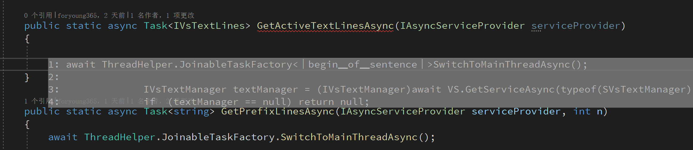

# LLMCopilot

[中文](.\README.md)

This is a Visual Studio extension based on [Ollama](https://github.com/ollama/ollama).

## Features
- Based on `Ollama`'s local large model, all data is stored locally and can be used even offline.
- Assists programming with large model capabilities:
  - Explains code
  - Auto-completion
  - Code error checking
  - Adds comments
  - Chats with the local large model

## Settings
- Supports customization to use different large models, allowing you to experiment:
  - Custom chat large model
  - Custom auto-completion large model

- Supports customization of the "Fill in the middle" token, compatible with more large models
- Auto-completion switch, default is off
  - Press `Ctrl` to accept all predictions
  - Press `numbers 1-9` to accept the top N lines of predictions
  - Press `ESC` to reject predictions

- Note! The default large model is `DeepSeek-Coder:6.7b`. If your VRAM is less than 4G, it is recommended to use the `DeepSeek-Coder` model. For VRAM of 8G and above, it is recommended to use `DeepSeek-Coder:6.7b`.
- If VRAM is less than 16G, it is not recommended to use different large models for `chatting` and `code completion` simultaneously, as this will cause the `Ollama` server to frequently load different models, leading to slow response and affecting the experience.
- Supports setting the model response language to Chinese or English (depending on model support)

## Screenshots

## Acknowledgements
- Thanks to [Ollama](https://github.com/ollama/ollama) for providing an excellent large model server backend and easy-to-use API interface.
- Thanks to [OllamaSharp](https://github.com/awaescher/OllamaSharp) for the client to access the Ollama API.
- Thanks to [MdXaml](https://github.com/whistyun/MdXaml) for markdown rendering in the chat window.
- Thanks to [privy](https://github.com/srikanth235/privy) for prompt templates。

Many thanks to them for providing excellent tools.
